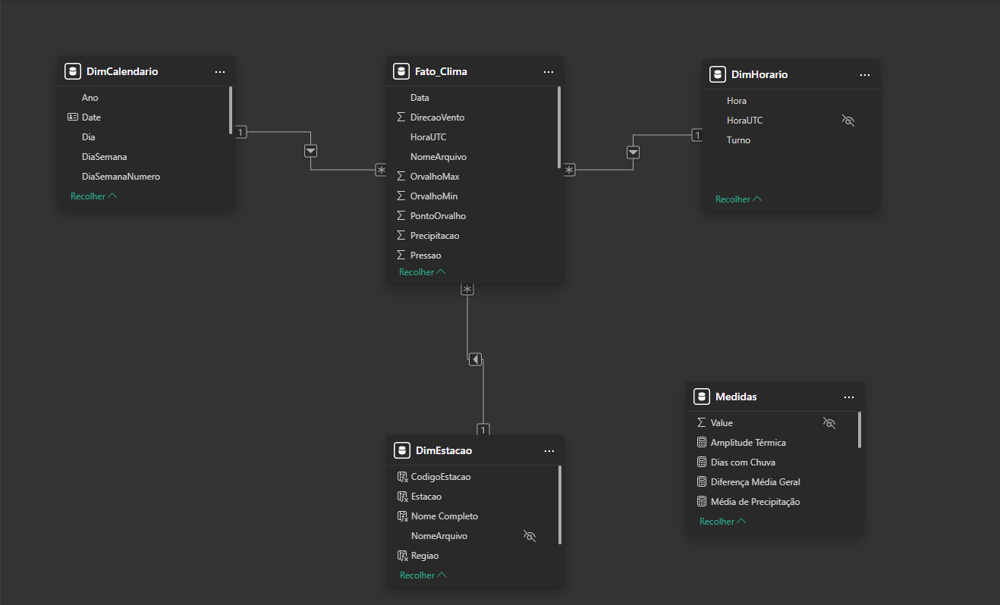

# Decisões de Modelagem

## Visão Geral

A modelagem dimensional foi desenvolvida utilizando o padrão **Star Schema (Esquema Estrela)**, amplamente empregado em soluções de Business Intelligence devido à sua simplicidade, desempenho e facilidade de manutenção.

O modelo foi estruturado a partir dos dados meteorológicos disponibilizados pelo Instituto Nacional de Meteorologia (INMET), permitindo consultas eficientes e a construção de indicadores analíticos para apoio à tomada de decisão.

---

# Granularidade

A definição da granularidade é uma das decisões mais importantes em um modelo dimensional.

Neste projeto, a granularidade adotada corresponde a **uma observação meteorológica registrada por uma estação em uma determinada data e horário**.

Cada registro da tabela fato representa, portanto, uma única medição realizada por uma estação meteorológica, preservando o maior nível de detalhamento disponível na base de dados.

Essa abordagem permite realizar agregações temporais e geográficas sem perda de informação, além de oferecer flexibilidade para diferentes tipos de análise.

---

# Estrutura do Modelo

O modelo dimensional é composto por uma tabela fato e três tabelas dimensão.

## Tabela Fato

### Fato_Clima

A tabela fato concentra todas as medidas quantitativas utilizadas nas análises.

Entre os principais atributos armazenados destacam-se:

* Temperatura do ar;
* Temperatura máxima;
* Temperatura mínima;
* Precipitação;
* Pressão atmosférica;
* Umidade relativa do ar;
* Velocidade do vento;
* Direção do vento;
* Radiação global.

Essa tabela constitui o núcleo do modelo analítico e estabelece relacionamento com todas as dimensões.

---

## Tabelas Dimensão

### DimCalendario

A dimensão calendário foi criada para possibilitar análises temporais consistentes.

Ela reúne atributos derivados da data, tais como:

* Ano;
* Mês;
* Nome do mês;
* Trimestre;
* Dia do mês;
* Dia da semana.

Sua utilização simplifica filtros temporais e viabiliza a implementação de medidas baseadas em inteligência temporal.

---

### DimHorario

A dimensão horário foi criada para representar os diferentes períodos do dia.

Além da hora do registro, foi implementada a classificação em turnos:

* Madrugada;
* Manhã;
* Tarde;
* Noite.

Essa estrutura permite identificar padrões climáticos associados aos diferentes períodos do dia.

---

### DimEstacao

A dimensão estação reúne as informações descritivas referentes às estações meteorológicas.

Os principais atributos utilizados são:

* Nome da estação;
* Unidade Federativa (UF);
* Região geográfica;
* Nome completo da estação.

Essa dimensão possibilita análises espaciais e comparações entre diferentes localidades.

---

# Relacionamentos

Os relacionamentos foram configurados seguindo o padrão recomendado para modelos dimensionais.

Cada dimensão possui relacionamento do tipo **um para muitos (1:N)** com a tabela fato, garantindo propagação adequada dos filtros e melhor desempenho durante as consultas.

Não foram utilizados relacionamentos muitos para muitos (N:N), evitando ambiguidades na interpretação dos dados.

---

# Justificativas da Modelagem

As principais decisões adotadas durante a modelagem foram:

| Decisão                           | Justificativa                                                                   |
| --------------------------------- | ------------------------------------------------------------------------------- |
| Utilização do Star Schema         | Simplifica consultas, melhora o desempenho e reduz a complexidade do modelo.    |
| Separação entre fatos e dimensões | Elimina redundâncias e facilita a manutenção do modelo.                         |
| Dimensão Calendário               | Permite análises temporais e implementação de funções de inteligência temporal. |
| Dimensão Horário                  | Possibilita análises por período do dia.                                        |
| Dimensão Estação                  | Centraliza atributos geográficos e evita repetição de informações.              |

---

# Modelo Dimensional

A Figura 1 apresenta o modelo dimensional implementado no Microsoft Power BI.

**Figura 1 – Modelo Star Schema desenvolvido para o projeto.**

---

# Conformidade com Boas Práticas

O modelo desenvolvido segue as principais recomendações para soluções de Business Intelligence:

* definição explícita da granularidade;
* separação entre fatos e dimensões;
* utilização de dimensões descritivas;
* relacionamentos simples e bem definidos;
* modelo orientado à análise;
* facilidade de expansão para inclusão de novas dimensões e fatos.

---

# Considerações Finais

A modelagem dimensional adotada permitiu organizar os dados meteorológicos de forma consistente e otimizada para consultas analíticas.

A utilização do padrão Star Schema favoreceu a construção das medidas em DAX, a implementação dos dashboards e a aplicação da Segurança em Nível de Linha (RLS), resultando em uma solução alinhada às boas práticas de Business Intelligence e aos requisitos estabelecidos para o Projeto Final da disciplina.