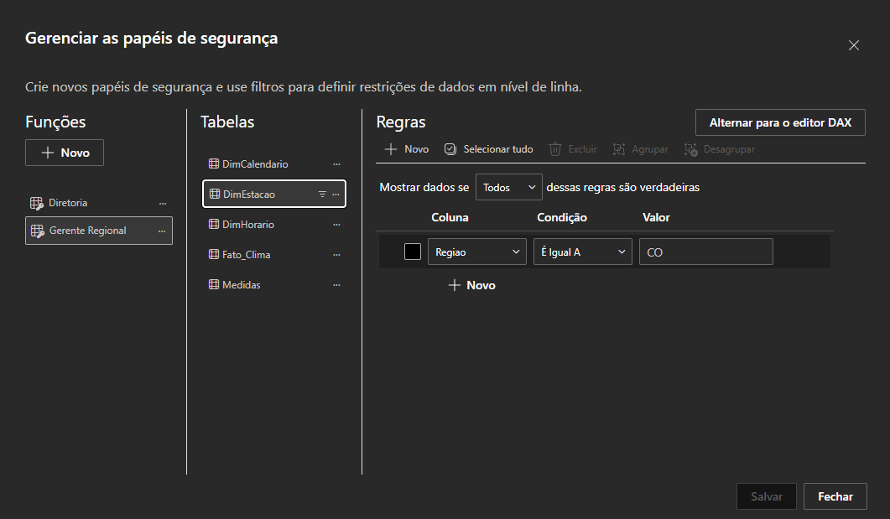

# Segurança em Nível de Linha (Row-Level Security)

## Objetivo

A Segurança em Nível de Linha (Row-Level Security – RLS) foi implementada com o objetivo de restringir a visualização dos dados conforme o perfil de acesso do usuário.

Embora este projeto possua finalidade acadêmica, a implementação do RLS simula um cenário comum em ambientes corporativos, nos quais diferentes perfis de usuários possuem permissões distintas para consulta das informações.

---

# Papéis Implementados

Foram definidos dois papéis distintos para demonstrar o funcionamento da Segurança em Nível de Linha.

| Papel            | Descrição                                                              |
| ---------------- | ---------------------------------------------------------------------- |
| Diretoria        | Possui acesso irrestrito a todas as informações do modelo.             |
| Gerente Regional | Possui acesso apenas aos registros pertencentes à Região Centro-Oeste. |

---

# Regra Aplicada

A restrição foi implementada sobre a tabela **DimEstacao**, utilizando a coluna responsável pela identificação da região geográfica.

## Papel: Gerente Regional

Filtro DAX aplicado:

```DAX
[Regiao] = "CO"
```

Esse filtro restringe automaticamente todas as visualizações do relatório aos registros pertencentes aos seguintes estados:

* Distrito Federal (DF);
* Goiás (GO);
* Mato Grosso (MT);
* Mato Grosso do Sul (MS).

---

## Papel: Diretoria

Não foi aplicado qualquer filtro para esse perfil.

Dessa forma, usuários pertencentes ao papel **Diretoria** possuem acesso completo ao conjunto de dados disponível no modelo.

---

# Implementação

A configuração foi realizada por meio do recurso **Gerenciar Funções** do Microsoft Power BI Desktop.

As restrições foram definidas diretamente sobre a dimensão **DimEstacao**, permitindo que os filtros fossem propagados automaticamente para a tabela fato por meio dos relacionamentos existentes no modelo dimensional.

Essa abordagem reduz a complexidade da implementação e segue as boas práticas recomendadas para modelos dimensionais.

---

# Validação

Após a criação dos papéis, a funcionalidade **Exibir como Funções** foi utilizada para validar o comportamento da solução.

Durante os testes foi possível verificar que:

* o papel **Gerente Regional** visualiza exclusivamente informações da Região Centro-Oeste;
* o papel **Diretoria** possui acesso integral ao modelo;
* os filtros são aplicados corretamente em todas as páginas do dashboard.

Os resultados obtidos confirmam o correto funcionamento da Segurança em Nível de Linha implementada.

---

# Evidências

A documentação do projeto contém as seguintes evidências da implementação:

**Figura 1 – Configuração das funções no Microsoft Power BI.**



---

**Figura 2 – Validação utilizando "Exibir como Funções".**


---

# Considerações Finais

A implementação da Segurança em Nível de Linha demonstra que o modelo desenvolvido é capaz de atender diferentes perfis de usuários sem a necessidade de criação de relatórios distintos.

Além de atender aos requisitos estabelecidos para o projeto da disciplina, essa funcionalidade aproxima a solução desenvolvida das práticas adotadas em ambientes corporativos de Business Intelligence, nos quais a governança e a segurança dos dados constituem aspectos fundamentais.
